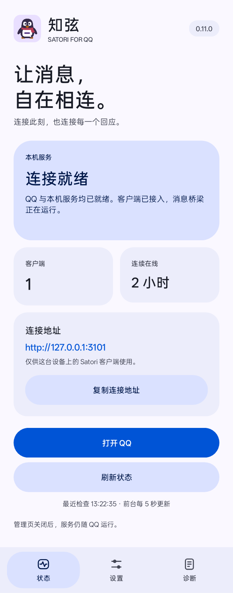
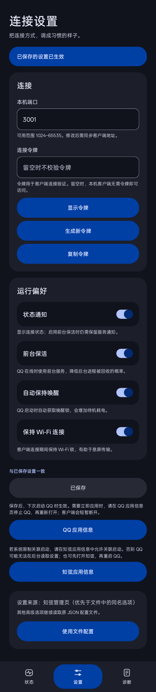
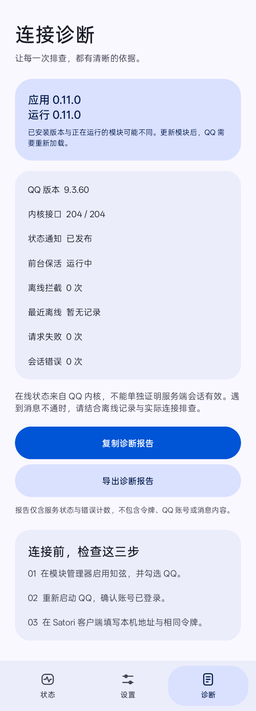

# 知弦 · Satori QQ


在 Android QQ 进程内提供 Satori v1 HTTP 与 WebSocket 服务。服务监听 `127.0.0.1:3001`，供 Koishi `adapter-satori` 等客户端连接。

已核验 QQ 9.3.55 与 9.3.60.40970（NT）。

## 知弦应用

普通版带 Material 3 Expressive 管理界面，分状态、设置、诊断三页。状态页显示 QQ、本机服务、客户端数与在线时长，并给出一键复制的连接地址。设置页管端口、令牌、状态通知、前台保活、自动唤醒与 Wi-Fi 保持，区分未保存、已保存与已生效。诊断页给应用与运行版本、接口检查和错误计数，报告不含令牌、账号与消息内容。

图标用企鹅和珊瑚红围巾呼应 QQ。白色腹部构成对话气泡。启动器、主题图标、通知与市场使用同源矢量。

<details>
<summary>查看应用界面</summary>

  

原生界面测试截图，状态使用演示数据；实际配色随系统主题变化。

</details>

## 运行条件

- Android 8.0 及以上
- QQ `com.tencent.mobileqq`
- 可为 QQ 启用模块作用域的 Xposed 兼容框架

## 安装

1. 安装市场发布的 `SatoriQQ.apk`
2. 在框架中启用模块，把 QQ 加入作用域
3. 重启 QQ
4. 打开「知弦」，在状态页确认 QQ、本机服务与客户端已连上

## 连接

```yaml
plugins:
  server:
    port: 5140
    selfUrl: 'http://127.0.0.1:5140'
  assets-local: {}
  adapter-satori:
    endpoint: 'http://127.0.0.1:3001'
    token: ''
```

`selfUrl` 与 `server.port` 保持一致。模块默认不校验令牌。设置 `token` 后，客户端必须使用相同值。

## 配置

首次使用按文件或默认值运行。管理页保存后，页面中的六项设置在 QQ 下次启动时覆盖文件同名项，高级选项继续按文件配置。「使用文件配置」可解除页面覆盖，同样在下次启动生效。

后台模块通过 Binder 接口读取应用私有设置，接口校验调用方 UID，不需要 root 或存储权限。令牌默认隐藏，显示时禁止系统截屏，复制时标记为敏感内容。管理页每 5 秒读取本机状态，只在前台轮询。

文件按顺序读取，取第一份有效配置：

```text
/sdcard/Android/data/com.tencent.mobileqq/files/satori-qq.json
/storage/emulated/0/Android/data/com.tencent.mobileqq/files/satori-qq.json
/sdcard/satori-qq.json
/storage/emulated/0/satori-qq.json
```

完整示例见 [`satori-qq.sample.json`](satori-qq.sample.json)。常用设置：

| 设置 | 默认值 | 说明 |
| --- | --- | --- |
| `port` | `3001` | 本地服务端口 |
| `token` | 空 | HTTP 与 WebSocket 鉴权令牌 |
| `status_notification` | `true` | 显示运行状态通知，点击切换到 QQ |
| `foreground_keepalive` | `true` | 在线时以前台服务保持 QQ 主进程 |
| `request_battery_exemption` | `true` | 首次在线时申请电池优化豁免 |
| `wake_lock_control` | `true` | 在通知中提供唤醒锁开关 |
| `wake_lock_auto` | `true` | 启动时自动获取唤醒锁 |
| `wifi_sustain` | `true` | 有客户端连接时保持 Wi-Fi 锁 |
| `media_retry_attempts` | `2` | 富媒体上传失败后的额外尝试次数 |
| `verbose_logs` | `false` | 输出调试日志 |
| `anti_detect` | `true` | Java 层环境检测处理 |
| `maps_hide` | `true` | Native 层进程信息过滤 |
| `block_turing_risk` | `true` | 停止 Turing 风控入口 |
| `block_server_kick` | `true` | 停止本地强制下线处理；服务端会话失效时仍需重新登录 |
| `fake_imei` / `fake_android_id` / `fake_serial` | 空 | 设备标识；留空用真实值，设置时应保持一致 |

过检测、限频与排队的其余开关见示例文件。修改配置后重启 QQ。

## 排障

强停或划掉 QQ 会停止服务。前台服务与唤醒锁能降低进程被回收或冻结的概率。两者都不能阻止系统在息屏期间断网。

锁屏后文字能发而图片、合并转发失败，是网络问题。文字只需在既有长连接上发一个包。富媒体上传要新建连接并持续传输。

- 关闭系统的「睡眠待机优化」或「深度睡眠」。ColorOS 的开关未必写回配置，确认 `deep_sleep_is_disable_net_allowed` 与 `deepsleep_network_switch` 已归零。
- 整机流量经 VPN 或 TUN 转发时，只加电池优化白名单不够。Doze 进入 `IDLE` 后经 TUN 的流量全部中断，`dumpsys deviceidle disable` 可立即恢复。Doze 没有 UI 开关，用 [`scripts/99-no-doze.sh`](scripts/99-no-doze.sh) 开机关闭，代价是待机功耗上升。

分不清断在哪一层时用 [`scripts/netwatch.sh`](scripts/netwatch.sh)，每 60 秒记录物理链路、本地代理、经 TUN 出站、模块状态与电源状态。

模块自报在线、消息却一条收不到，多半是被服务端踢线。踢线的处理链在客户端互不经过。模块逐条拦在入口，也保住盘上的登录态。判定口径与计数见 [`docs/ANTIDETECT.md`](docs/ANTIDETECT.md)。

[`scripts/qq-revive.sh`](scripts/qq-revive.sh) 看守 QQ：按踢线记录行数增长、`online=false` 与「MSF 进程没有上游连接」判断，必要时重启 QQ。重启有预算——两次间隔至少 10 分钟、每小时最多 3 次，超了只记日志。装法见 [`scripts/98-qq-revive.sh`](scripts/98-qq-revive.sh) 开头。

### 系统拦截关联启动时

部分 ColorOS 设备会拦截知弦的配置提供程序。该程序由 QQ 在后台拉起。在**系统设置 → 应用 → 关联启动**里允许知弦，再重启 QQ。设置读不到时页面会明确提示，QQ 继续使用文件或默认配置。

## 构建与测试

首次构建需准备 Android 35 平台、R8 与 `org.json`：

```sh
curl -fsSL -o libs/r8.jar https://maven.google.com/com/android/tools/r8/8.9.35/r8-8.9.35.jar
curl -fsSL -o libs/json.jar https://repo1.maven.org/maven2/org/json/json/20250517/json-20250517.jar
./build.sh
./test.sh
```

产物为 `build/SatoriQQ.apk`。`test.sh` 先跑 JVM 单测，再编译运行 `tests/mapshide-filter-test.c`，覆盖配置校验、只读健康探测、诊断脱敏与清单契约。真机巡检脚本需要 QQ 已上线：

```sh
node tests/ws-health.js             # 健康与自检
node tests/ws-kernel-extras.js      # 扩展读取动作
node tests/ws-kernel-writes.js      # 扩展写入动作，自带清理
node tests/internal-kernel-probe.js # 官方 internal 路由与扩展动作
node tests/media-live-probe.js voice # 语音条、文件与群文件能不能真发出去，见脚本头注释
```

升级 QQ 之后先跑一次接口面自检，它会指出断在哪个类、哪个字段或哪个回调，再跑上面的巡检：

```sh
curl -s -X POST http://127.0.0.1:3001/v1/internal/compat -d '{}' | head -c 400
```

管理界面另有独立的真机测试包：`bash tests/ui/build.sh` 构建，安装后执行 `am instrument -w com.satori.qq.test/.DesignSmoke`。它只操作知弦自己的界面，不发送消息，也不重启 QQ。

## 文档

- [`docs/SATORI_SUPPORT.md`](docs/SATORI_SUPPORT.md)：协议方法、事件与消息元素
- [`docs/ARCHITECTURE.md`](docs/ARCHITECTURE.md)：内部结构、QQ 升级检查项与版本号规则
- [`docs/ANTIDETECT.md`](docs/ANTIDETECT.md)：QQ 检测面与模块的处理边界

## 致谢与许可

过检测实现参考 [QQEnhancedBypass](https://github.com/Xalsace/QQEnhancedBypass)。

本项目可按 [Apache-2.0](LICENSE-APACHE) 或 [MIT](LICENSE-MIT) 许可证使用。
